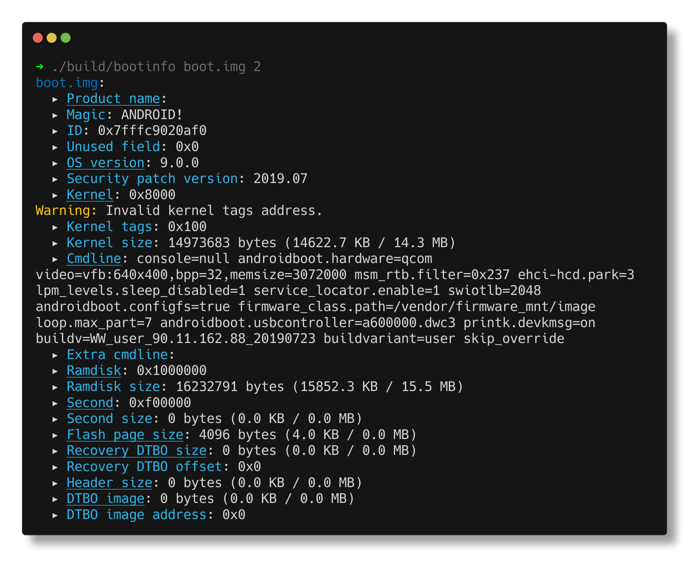

# Android Things/BootInfo



An utility for parsing the header section of Android boot images.

## Building

Run the following command in the current directory:

```bash
./build.sh
```

## Usage

```
./bootinfo <boot.img> <boot header version>
./bootinfo-textonly <boot.img> <boot header version>
```

**Supported header versions**: v0, v1, v2.

## Useful Links

* [Android bootimg.h](https://android.googlesource.com/platform/system/tools/mkbootimg/+/refs/heads/master/include/bootimg/bootimg.h)
